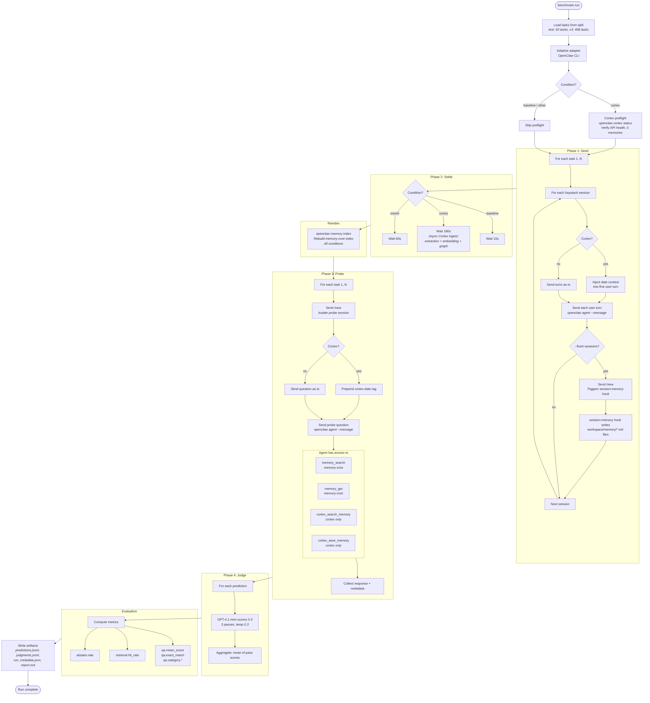
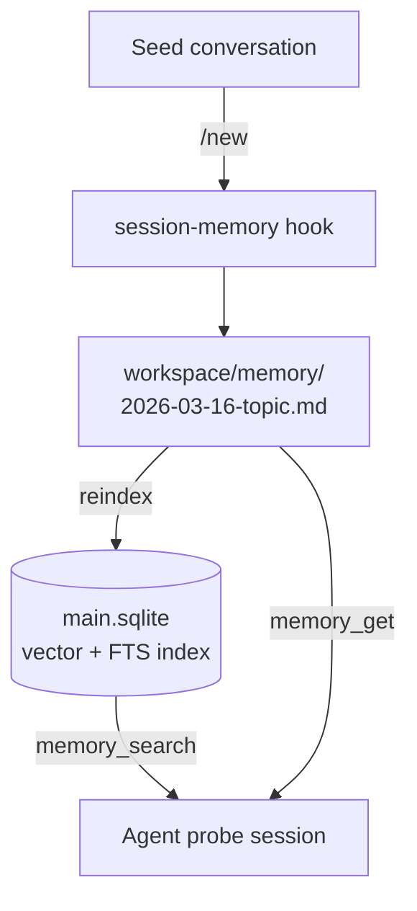
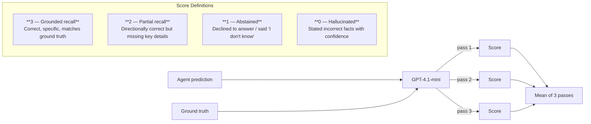

# Benchmark Pipeline

## General Pipeline

All conditions follow the same four-phase pipeline. Condition-specific behavior is injected at well-defined points within each phase.



## Baseline Condition

The baseline measures memory-core (OpenClaw's built-in memory system) in isolation. No external memory service is involved.

```mermaid
flowchart LR
    subgraph SEED [Seed Phase]
        direction TB
        S1[User turns sent<br/>to OpenClaw agent] --> S2[/new flushes session]
        S2 --> S3[session-memory hook<br/>extracts summaries]
        S3 --> S4[Writes workspace/memory/*.md]
    end

    subgraph SETTLE [Settle: 10s]
        direction TB
        W1[Brief wait for<br/>file I/O completion]
    end

    subgraph REINDEX [Reindex]
        direction TB
        R1[openclaw memory index]
        R1 --> R2[Embeds memory files<br/>text-embedding-3-small]
        R2 --> R3[Stores in SQLite<br/>main.sqlite]
    end

    subgraph PROBE [Probe Phase]
        direction TB
        P1[/new — fresh session] --> P2[Question sent to agent]
        P2 --> P3{Agent decides}
        P3 -->|search| P4[memory_search<br/><i>semantic over indexed .md</i>]
        P3 -->|read| P5[memory_get<br/><i>read specific file/lines</i>]
        P3 -->|no tool| P6[Answer from<br/>system prompt context]
        P4 --> P7[Response]
        P5 --> P7
        P6 --> P7
    end

    SEED --> SETTLE --> REINDEX --> PROBE
```

### Memory flow



## Cortex Condition

The cortex condition adds Cortex (server-side long-term memory) on top of memory-core. The agent has access to both memory systems during probes.

```mermaid
flowchart LR
    subgraph SEED [Seed Phase]
        direction TB
        S1[User turns sent with<br/>date context injected] --> S2[/new flushes session]
        S2 --> S3[session-memory hook<br/>writes workspace/memory/*.md]
        S2 --> S4[Cortex auto-capture hook<br/>extracts facts to server]
    end

    subgraph SETTLE [Settle: 180s]
        direction TB
        W1[Cortex async pipeline]
        W1 --> W2[Extraction]
        W2 --> W3[Embedding]
        W3 --> W4[Graph build]
    end

    subgraph REINDEX [Reindex]
        direction TB
        R1[openclaw memory index<br/><i>memory-core files</i>]
    end

    subgraph PROBE [Probe Phase]
        direction TB
        P0[/new — fresh session] --> P0A[Cortex auto-recall<br/>injects memories block]
        P0A --> P1[Question with<br/>cortex-date tag]
        P1 --> P2{Agent decides}
        P2 -->|memory-core| P3[memory_search / memory_get]
        P2 -->|cortex| P4[cortex_search_memory]
        P2 -->|no tool| P5[Answer from context<br/>+ auto-recalled memories]
        P3 --> P6[Response]
        P4 --> P6
        P5 --> P6
    end

    SEED --> SETTLE --> REINDEX --> PROBE
```

### Dual memory architecture

```mermaid
flowchart TD
    CONV[Seed conversation] -->|/new| HOOK_LOCAL[session-memory hook]
    CONV -->|agent_end| HOOK_CORTEX[Cortex auto-capture]

    HOOK_LOCAL --> MD[workspace/memory/*.md]
    HOOK_CORTEX --> API[Cortex API /v1/jobs/ingest]

    MD -->|reindex| SQLITE[(main.sqlite)]
    API -->|async pipeline| CORTEX_DB[(Cortex server<br/>memories + graph)]

    subgraph PROBE_SESSION [Probe session]
        direction TB
        NEW[/new] --> AUTO_RECALL[Cortex auto-recall<br/>/v1/recall]
        AUTO_RECALL --> INJECT["&lt;cortex_memories&gt; block<br/>prepended to prompt"]
        INJECT --> QUESTION[Probe question]
        QUESTION --> AGENT{Agent}
    end

    SQLITE -->|memory_search| AGENT
    MD -->|memory_get| AGENT
    CORTEX_DB -->|cortex_search_memory| AGENT
    CORTEX_DB -->|auto-recall| AUTO_RECALL
```

## Judge Scoring Rubric



## Condition Comparison

| Aspect | Baseline | Cortex |
|--------|----------|--------|
| Memory write | session-memory hook only | session-memory + Cortex auto-capture |
| Memory storage | Local .md files + SQLite index | Local files + Cortex server (cloud) |
| Settle time | 10s | 180s (async ingest pipeline) |
| Auto-recall injection | No | Yes (before each turn) |
| Date context in seeds | No | Yes (haystack_dates injected) |
| Date context in probes | No | Yes (cortex-date tag) |
| Tools available | memory_search, memory_get | memory_search, memory_get, cortex_search_memory, cortex_save_memory |
| Preflight check | None | Cortex status verified |
